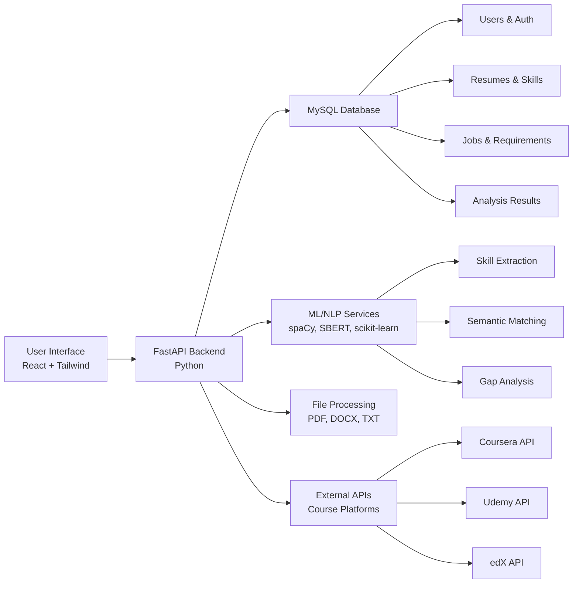
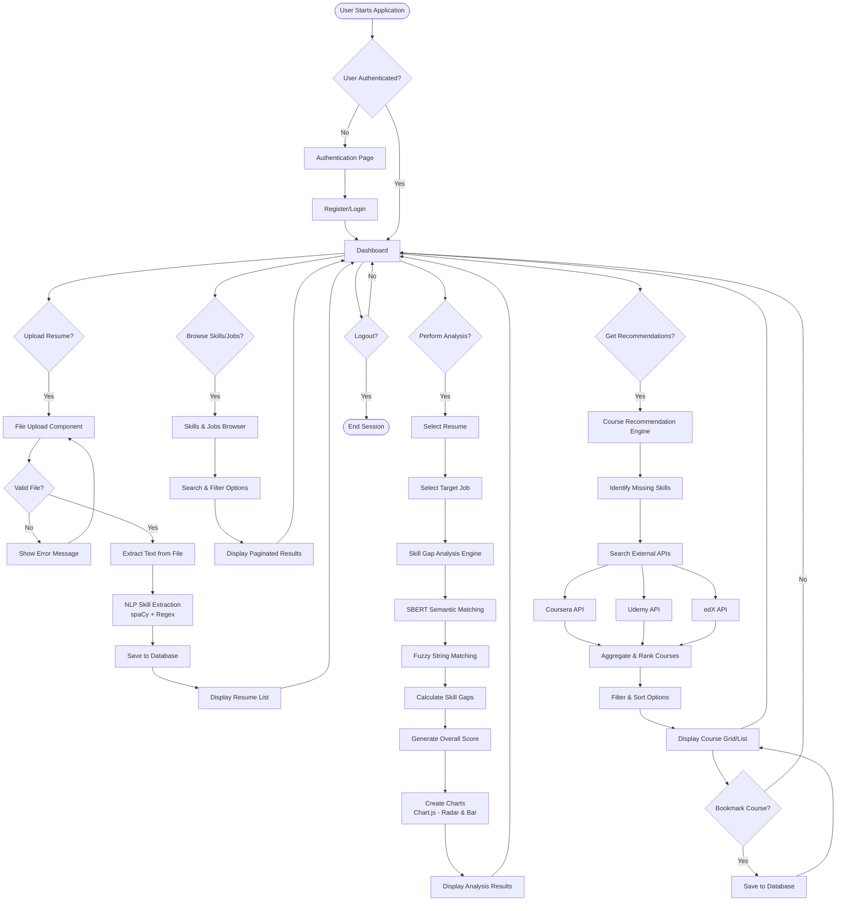
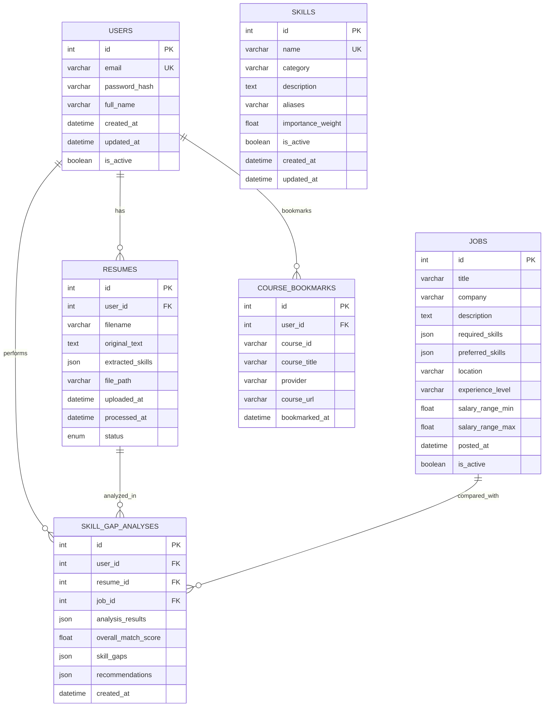
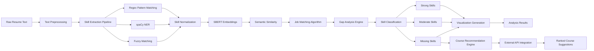

# Skill Gap Analyzer - Project Structure & Workflow

## 1. Project Directory Structure

```mermaid
graph TB
    A[skill-gap-analyzer/] --> B[backend/]
    A --> C[frontend/]
    A --> D[data/]
    A --> E[docs/]
    A --> F[database/]
    
    B --> B1[main.py]
    B --> B2[run.py]
    B --> B3[config.py]
    B --> B4[requirements.txt]
    B --> B5[routers/]
    B --> B6[services/]
    B --> B7[utils/]
    B --> B8[models/]
    B --> B9[tests/]
    
    B5 --> B5a[auth.py]
    B5 --> B5b[resumes.py]
    B5 --> B5c[skills_jobs.py]
    B5 --> B5d[analysis.py]
    
    B6 --> B6a[skill_extractor.py]
    B6 --> B6b[nlp_trainer.py]
    B6 --> B6c[skill_gap_engine.py]
    B6 --> B6d[course_recommender.py]
    
    B7 --> B7a[database.py]
    B7 --> B7b[auth_utils.py]
    B7 --> B7c[file_processor.py]
    
    B8 --> B8a[schemas.py]
    
    C --> C1[src/]
    C --> C2[public/]
    C --> C3[package.json]
    C --> C4[tailwind.config.js]
    
    C1 --> C1a[components/]
    C1 --> C1b[pages/]
    C1 --> C1c[services/]
    C1 --> C1d[utils/]
    C1 --> C1e[App.js]
    C1 --> C1f[index.js]
    
    C1a --> C1a1[auth/]
    C1a --> C1a2[common/]
    C1a --> C1a3[resume/]
    C1a --> C1a4[analysis/]
    C1a --> C1a5[recommendations/]
    
    D --> D1[raw/]
    D --> D2[processed/]
    D --> D3[models/]
    
    D1 --> D1a[resume_dataset.csv]
    D1 --> D1b[skill_ontology.csv]
    D1 --> D1c[job_postings.csv]
    
    F --> F1[schema.sql]
    F --> F2[seed_data.sql]
    F --> F3[stored_procedures.sql]
    F --> F4[README.md]
```



## 2. System Architecture & Data Flow



## 3. Complete Application Workflow



## 4. Database Schema Relationships



## 5. ML/NLP Pipeline Workflow



## 6. API Architecture

```mermaid
graph TB
    A[Frontend React App] --> B[FastAPI Main App]
    
    B --> B1[Authentication Router<br/>/api/v1/auth]
    B --> B2[Resume Router<br/>/api/v1/resumes]
    B --> B3[Skills & Jobs Router<br/>/api/v1/skills-jobs]
    B --> B4[Analysis Router<br/>/api/v1/analysis]
    
    B1 --> B1a[POST /register]
    B1 --> B1b[POST /login]
    B1 --> B1c[GET /me]
    B1 --> B1d[POST /logout]
    
    B2 --> B2a[POST /upload]
    B2 --> B2b[GET /]
    B2 --> B2c[GET /{id}]
    B2 --> B2d[DELETE /{id}]
    B2 --> B2e[POST /{id}/reprocess]
    
    B3 --> B3a[GET /skills]
    B3 --> B3b[GET /jobs]
    B3 --> B3c[GET /skills/search]
    B3 --> B3d[GET /jobs/search]
    
    B4 --> B4a[POST /analyze]
    B4 --> B4b[GET /history]
    B4 --> B4c[POST /recommend-courses]
    B4 --> B4d[GET /bookmarks]
    B4 --> B4e[POST /bookmark]
    
    B1a --> C[MySQL Database]
    B1b --> C
    B1c --> C
    B2a --> C
    B2b --> C
    B3a --> C
    B3b --> C
    B4a --> C
    
    B2a --> D[File Processing Service]
    B4a --> E[ML/NLP Services]
    B4c --> F[Course APIs]
```
